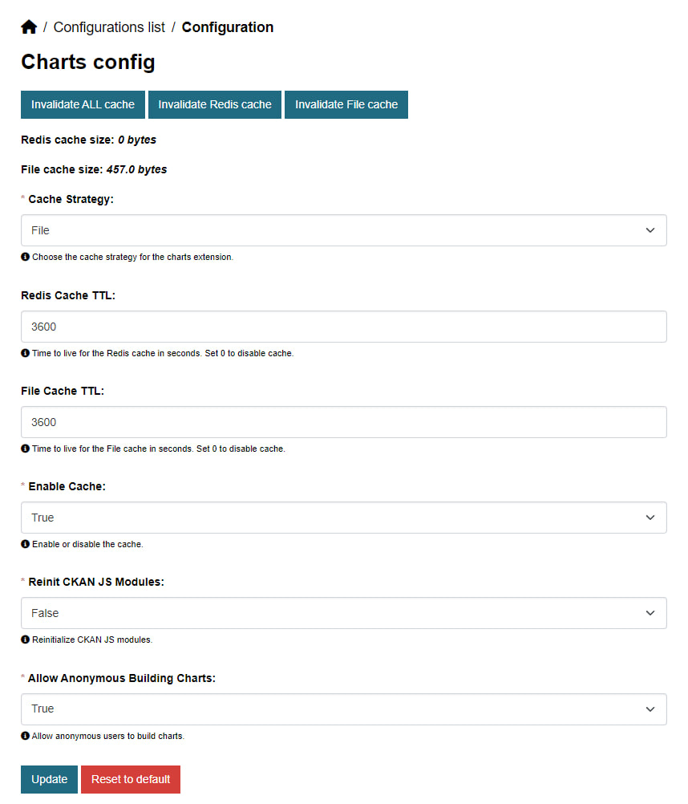

Configuration options

There is a number of configuration options available for the extension. You can set them in the CKAN configuration file or using the admin configuration page.

## Configuration options

### Cache strategy
**`ckanext.charts.cache_strategy`** [__optional__]

Cache strategy for chart data.

**Options**: `redis`, `file_orc`, `file_csv`

**Type**: `str`

**Default**: `redis`

-----

### Redis cache TTL

**`ckanext.charts.redis_cache_ttl`** [__optional__]

Time to live for the Redis cache in seconds. Set to `0` to disable cache.

**Type**: `int`

**Default**: `3600`

-----

### File cache TTL

**`ckanext.charts.file_cache_ttl`** [__optional__]

Time to live for the File cache in seconds. Set to `0` to disable cache.

**Type**: `int`

**Default**: `3600`

-----

### Enable cache

**`ckanext.charts.enable_cache`** [__optional__]

Enable cache for the charts.

???+ Warning
    If the cache is disabled, the chart data will be fetched from the data source every time the chart is rendered.
    It could lead to performance issues if the data source is slow or the data is too large.

**Type**: `bool`

**Default**: `true`

-----

### Include HTMX

**`ckanext.charts.include_htmx_asset`** [__optional__]

Include HTMX assets. Could be disabled if another plugins are including it.

**Type**: `bool`

**Default**: `true`

-----

### Reinit CKAN JS

**`ckanext.charts.reinit_ckan_js_modules`** [__optional__]

Reinit CKAN JS modules after HTMX swap.

**Type**: `bool`

**Default**: `false`

-----

### Allow anonymous users to build charts

**`ckanext.charts.allow_anon_building_charts`** [__optional__]

By default, only authenticated users can build charts. If you want to allow anonymous users to build charts, set this option to `true`.

**Type**: `bool`

**Default**: `false`

-----

## Admin config page

The extension provides an admin configuration page where you can set all the listed configuration options. The admin page available only
using an extension [`ckanext-admin-panel`](https://github.com/DataShades/ckanext-admin-panel). The admin panel is a separate extension that provides an alternative admin interface for CKAN. It allows you to manage CKAN settings and other extensions settings through the web interface.

This page could be accessed by the following URL: `/admin-panel/charts/config`, but it will be registered only if the `ckanext-admin-panel` is installed and enabled.
