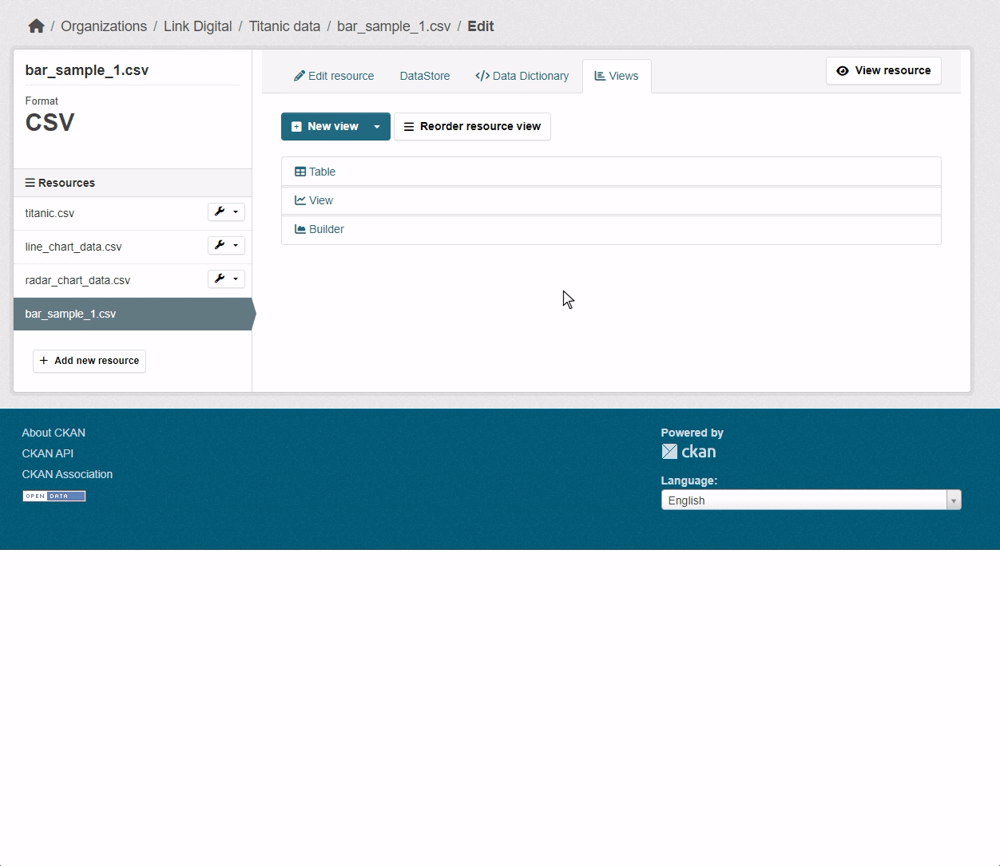
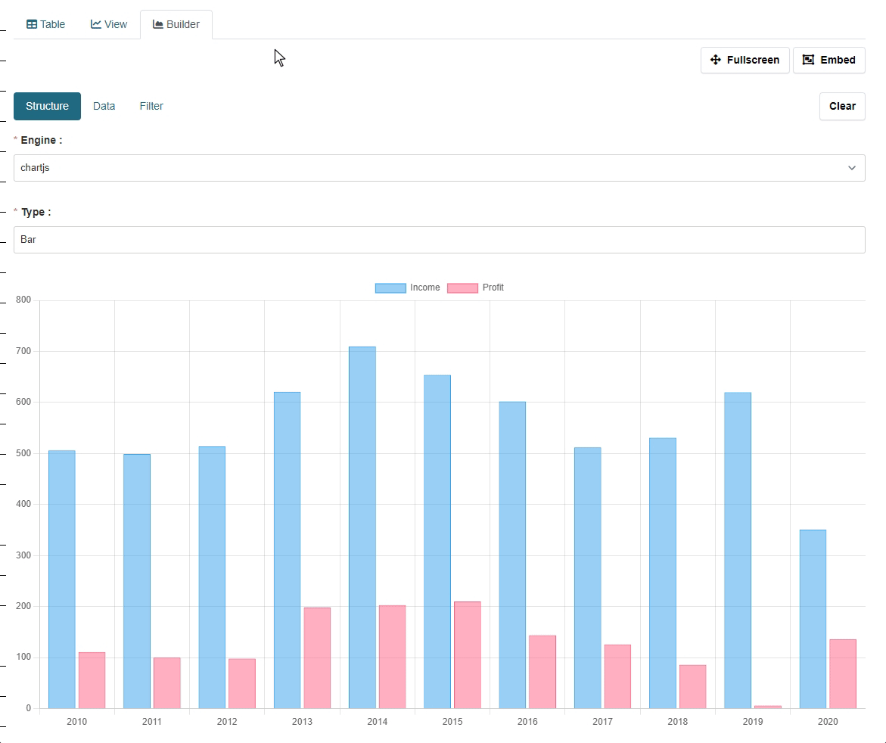
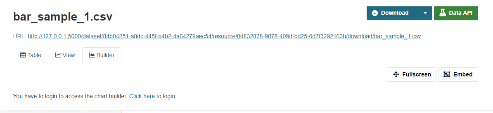

## Basic usage

This extension offers two plugins: `charts_view` and `charts_builder_view`. The first plugin is a standard chart builder designed for system administrators or anyone with permission to edit or create a resource view. Creating a preview using this plugin generates a static chart with saved settings. This chart retains the settings and will always be rendered in the same way.

The `charts_builder_view` plugin does not have any special settings during the creation or editing stages. Instead, it renders a chart builder JS widget on a resource page, allowing any user to interact with the resource data and create a chart that meets their needs. In the future, we plan to implement a feature that will allow users to save their charts.

## Restrict user chart builder for anonymous users

The user chart builder could be restricted to only authenticated users. See the config settings section for more information. In this case, user will be forced to log in to build a chart. After the user logs in, user will be redirected to the chart builder page back.

